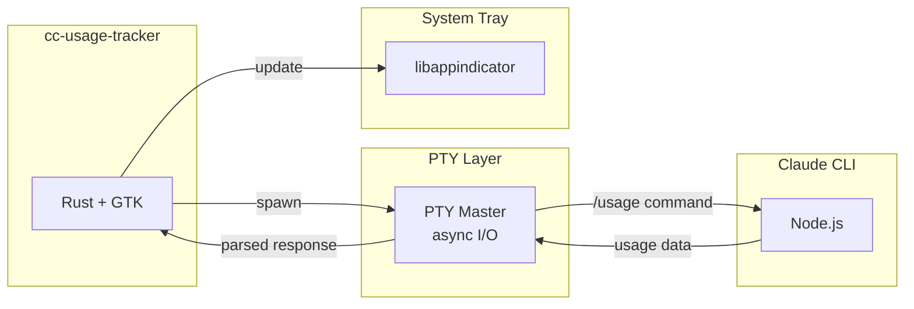
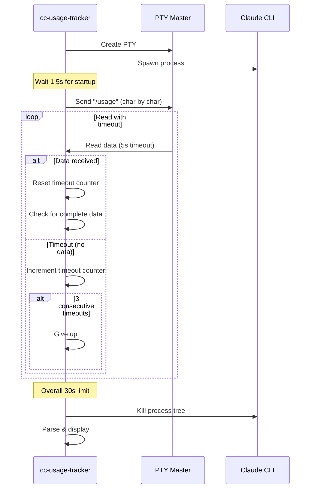

# cc-usage-tracker

[](https://github.com/0xGeorgii/cc-usage-tracker/actions/workflows/build.yml) | 
[](https://github.com/0xGeorgii/cc-usage-tracker/actions/workflows/release.yml)

A Linux system tray application that displays your Claude Code usage statistics at a glance.

## Features

- **Real-time usage display** in system tray with visual progress bar
- **Session usage** (5-hour window) with reset countdown
- **Weekly usage** (7-day) across all models
- **Sonnet-specific usage** tracking (optional, toggleable)
- **Timer scheduling** - schedule reminders for Morning, Afternoon, or Evening
- **8 visual themes** - Minimal, Blocks, Soft, Lines, Sharp, Neon (default), Modern, Contemporary
- **Configurable update intervals** - 1, 5, 15, or 30 minutes
- **Smart system integration** - pauses during sleep/screen lock via D-Bus
- Lightweight and unobtrusive

## Requirements

- Linux with a system tray (GNOME, KDE, XFCE, etc.)
- Claude Code CLI installed and authenticated (`claude` command available)
- GTK3 and libappindicator3

### System Dependencies

**Debian/Ubuntu:**
```bash
sudo apt install libgtk-3-dev libappindicator3-dev
```

**Fedora:**
```bash
sudo dnf install gtk3-devel libappindicator-gtk3-devel
```

**Arch Linux:**
```bash
sudo pacman -S gtk3 libappindicator-gtk3
```

## Installation

### From Release (Recommended)

Download the latest release from the [Releases page](https://github.com/georgii/cc-usage-tracker/releases):

```bash
# Extract the tarball
tar -xzf cc-usage-tracker-linux-x86_64.tar.gz

# Move to a directory in your PATH
sudo mv cc-usage-tracker /usr/local/bin/
sudo mkdir -p /usr/local/share/cc-usage-tracker
sudo mv assets /usr/local/share/cc-usage-tracker/
```

### From Source

1. Install Rust (if not already installed):
   ```bash
   curl --proto '=https' --tlsv1.2 -sSf https://sh.rustup.rs | sh
   ```

2. Clone the repository:
   ```bash
   git clone https://github.com/georgii/cc-usage-tracker.git
   cd cc-usage-tracker
   ```

3. Build and run (assets are found automatically during development):
   ```bash
   cargo build --release
   cargo run --release
   ```

4. Optional: Install system-wide:
   ```bash
   sudo cp target/release/cc-usage-tracker /usr/local/bin/
   ```

## Usage

Simply run the application:
```bash
cc-usage-tracker
```

The indicator will appear in your system tray showing your current usage percentage and time until reset.

### Tray Display

- **Label format:** `▮▮▯▯▯ 40% ⧗2h15m` - Visual progress bar, percentage, and reset time
- **Click** the indicator to open the menu:

```
╔═ SESSION ═╗ 40% · Resets in 2h 15m
▓▓▓▓░░░░░░
╔═ WEEKLY ═╗ 25% · Resets in 3d 4h
▓▓▓░░░░░░░
╔═ SONNET ═╗ 10% · 7-day window
▓░░░░░░░░░
Updated 14:30
────────────────────
⏰ Scheduled: 8:00 AM
Schedule Timer
────────────────────
Settings
────────────────────
▪ Quit
```

### Settings Menu

- **Display** - Toggle Sonnet section and "Updated" timestamp
- **Update Interval** - Choose polling frequency (1/5/15/30 min)
- **Theme** - Select from 8 visual themes

### Timer Scheduling

Schedule a reminder to start working at a specific time:
- **Morning** (6 AM - 12 PM)
- **Afternoon** (12 PM - 6 PM)
- **Evening** (6 PM - 12 AM)

When the scheduled time arrives, the app sends a "start timer" message to Claude CLI.

### Themes

| Theme | Style | Example |
|-------|-------|---------|
| Minimal | ASCII | `==··· 40% ~2h` |
| Blocks | Bold | `██░░░ 40% ▸2h` |
| Soft | Circles | `◉◉○○○ 40% ⏲2h` |
| Lines | Box-drawing | `━━┄┄┄ 40% ›2h` |
| Sharp | Diamonds | `◆◆◇◇◇ 40% »2h` |
| **Neon** (default) | High contrast | `▮▮▯▯▯ 40% ⧗2h` |
| Modern | Sleek | `▰▰▱▱▱ 40% ◷2h` |
| Contemporary | Clean | `▪▪▫▫▫ 40% →2h` |

### Autostart

To start automatically on login, create a desktop entry:

```bash
mkdir -p ~/.config/autostart
cat > ~/.config/autostart/cc-usage-tracker.desktop << EOF
[Desktop Entry]
Type=Application
Name=Claude Code Usage Tracker
Exec=cc-usage-tracker
Hidden=false
NoDisplay=false
X-GNOME-Autostart-enabled=true
EOF
```

## Development

```bash
# Build debug version
cargo build

# Run with logging
cargo run

# Run tests
cargo test

# Check for issues
cargo clippy

# Generate documentation
cargo doc --open
```

## How It Works

The application fetches usage data by running the Claude CLI with the `/usage` command using direct PTY (pseudo-terminal) control via the `pty-process` crate.

### Architecture



### Key Features

- **Direct PTY control**: Uses `pty-process` crate for proper terminal emulation (Claude CLI requires a TTY)
- **Character-by-character input**: Handles Claude CLI's autocomplete by sending keystrokes individually
- **Three-level timeout strategy** (see diagram below)
- **Retry mechanism**: Up to 2 retries for transient failures (network issues, slow startup)
- **Process tree cleanup**: Kills entire process tree including grandchildren on completion
- **Orphan prevention**: Uses `PR_SET_PDEATHSIG` and process group isolation
- **System event handling**: Monitors D-Bus for sleep/wake and screen lock/unlock events to pause polling

### Timeout Strategy



### Data Extraction

It parses the terminal output to extract:
- Usage percentages (handles both `% used` and `%used` formats)
- Reset times (converted to countdown format)
- Supports "Current session", "Current week (all models)", and "Sonnet only" sections

The `/usage` command is a local CLI command that queries the API directly without consuming any model tokens. The app polls at a configurable interval (default: 5 minutes) and updates the tray label and menu with fresh data.

## Troubleshooting

### "CC: Error" in tray

- Ensure Claude Code CLI is installed: `which claude`
- Ensure you're logged in: `claude` should start without auth errors
- Check logs: run `cc-usage-tracker` from terminal to see error messages

### Timeout errors

The app has a robust three-level timeout strategy, but issues can still occur:

- **Per-read timeout (5s)**: If Claude CLI stops outputting data
- **Overall timeout (30s)**: If the entire operation takes too long

To debug:
```bash
# Run from terminal to see detailed logs
cc-usage-tracker 2>&1 | grep -E '\[fetch\]|\[read\]'

# Check if Claude CLI responds
echo '/usage' | timeout 10 claude
```

### Tray icon not visible

- Ensure your desktop environment supports AppIndicator/system tray
- For GNOME, you may need the "AppIndicator Support" extension

### Usage not updating

- The app polls at your configured interval (default: 5 minutes); wait for the next update
- Check terminal output for timeout or parsing errors
- The app retries up to 2 times on transient failures
- If screen is locked, polling is paused until unlock

### Orphaned processes

The app includes comprehensive process cleanup, but if issues occur:
```bash
# Check for orphaned claude processes
ps aux | grep claude | grep -v grep

# Manually clean up if needed (be careful not to kill your active sessions)
pkill -f "claude.*usage"
```

## Contributing

Contributions are welcome! Please ensure your code passes CI checks:

```bash
cargo fmt --check    # Code formatting
cargo clippy         # Linting
cargo test           # Unit tests
cargo build --release
```

## License

MIT
